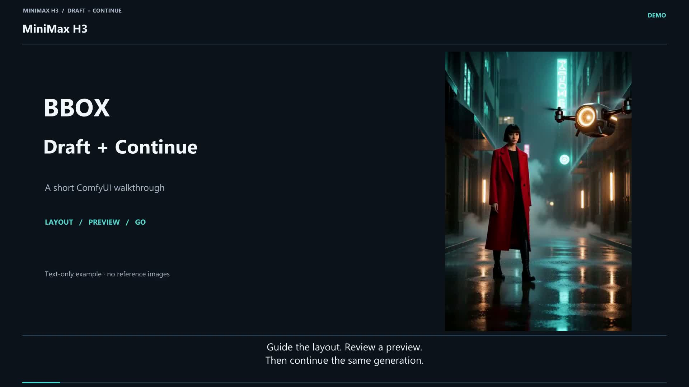

# MiniMax H3 Draft Continue — v1.7.10

**1枚見て、気に入ったら同じH3生成の続きへGO。既存WorkflowのSampler部分に挿入できます。**

## BBOXなしの基本ワークフロー

**[BBOXなしのワークフローをダウンロード](https://raw.githubusercontent.com/ukr8b3g-cmyk/MiniMax-H3-T2VA-Draft-Continue/main/examples/H3-Draft-Sampler-Turbo6.json)** — ComfyUIで読み込める通常のJSONです。Previewで最初のフレームの予測を確認し、GOで動画・音声のDecodeと保存まで続行します。Structured CanvasやBBOXノードは不要です。

実行前に、導入済みのH3モデル・テキストエンコーダー・VAE・対応するTurbo LoRAを選択してください。初期設定はEuler/simple、全6ステップ・Preview 3ステップ、24 fps、約5秒です。今回の追加では構成を検証しており、このテンプレートのGPU再実行はしていません。

## 解説動画と配布用テンプレート

[](https://youtu.be/4cMJKsY5B_o)

**[YouTubeで操作を見る：BBOX Layout, Preview & Continue](https://youtu.be/4cMJKsY5B_o)** — 英語音声・字幕付き、約94秒。

**[T2VA Neon Workflowをダウンロード](https://raw.githubusercontent.com/ukr8b3g-cmyk/MiniMax-H3-T2VA-Draft-Continue/main/examples/H3-BBOX-Draft-Continue-Neon-v1.json)** · [導入・モデル設定](docs/VIDEO_TUTORIALS.md)

説明用に整理したテンプレートです。START/ENDのBBOXを指定し、3ステップのPreviewで最初のフレームの中間予測を確認してから、GOで同じ生成の残り3ステップへ進みます。配布版は録画時よりBBOX編集欄を大きくしています。テキストのみで使用でき、参照画像は不要です。

**Runtime / UI Build: 1.7.10。** Continueはキューに入れた出力処理全体の成功後に`COMPLETE`へ移ります。**Phase 4CのC0〜C11は実GPU/UIでPASS / COMPLETEです。** 5サイクルのC9耐久試験では有意な累積VRAM増加・リーク傾向はなく、最終C11 Production回帰もPASSしました。[検証状況](docs/PHASE4C_STATUS.md)・[C9実測記録](docs/C9_GPU_ENDURANCE.md)

### 2画像のI2VA · Cyberpunk

[](https://youtu.be/HopdznXTFjk)

**[YouTubeで2画像のI2VA操作を見る](https://youtu.be/HopdznXTFjk)** — 約1分55秒、英語女性音声・字幕・静かなオリジナルBGM付き。**2560 × 1440**で録画・書き出し、操作部分を拡大しています。生成待ちは短縮し、その旨を表示しています。

**[Cyberpunk Workflow＋参照画像2枚をダウンロード](https://raw.githubusercontent.com/ukr8b3g-cmyk/MiniMax-H3-T2VA-Draft-Continue/main/examples/H3-I2VA-BBOX-Cyberpunk-v1.zip)** · [JSONのみ](examples/H3-I2VA-BBOX-Cyberpunk-v1.json) · [接続方法と実機結果](docs/VIDEO_TUTORIALS.md#two-reference-i2va--cyberpunk)

人物とローバーの参照画像をCanvasのA/Bへ接続します。実GPUでPreview → GO → Decode/Saveまで完了した作例です。参照画像は被写体の指定であり、動画の最初と最後のフレームではありません。生成動画は768 × 512、解説画面は1440pです。

## v1.7.6 — Phase 4B Lifecycle / Stale-State Management

Phase 4Bでは、**開いたままのWorkflowタブを切り替えて戻った場合**に、レビュー済みUI状態をブラウザーセッション内だけで保持します。v1.7.1ではComfyUIのgraph clone/clean順序に合わせ、`beforeLoadGraph`で旧Stateを捕捉し、`afterLoadGraph`でWorkflowタブpath単位に復元する方式へ修正しました。

保持対象は `READY / STALE / COMPLETE` です。承認StateをWorkflow JSONへ保存することはありません。そのため、Workflowを閉じて保存済みファイルから再度開いた場合は、従来どおり新しいPreviewが必要です。

また、Draftが`READY`の間はComfyUIの`graphChanged`を監視し、上流graph signatureを再確認します。Prompt、Layout、Reference、Sampler入力など実行内容に関わる変更を検出すると、GOを押す前に`PREVIEW STALE / NEW PREVIEW REQUIRED`へ移行してGOを無効化します。GO直前のsignature再確認も残します。

**Phase 4BはB0〜B10すべてGPU/UI PASS / COMPLETEです。** v1.7.6ではページ固有の承認所有トークンを導入し、Ctrl+F5/完全再読込後に旧READY/COMPLETEを再利用しない一方、通常のWorkflowタブ往復ではB2/B7の状態保持を維持します。

## v1.6.0 — Phase 4A Preview / GO State UX

DraftとContinueを、ブラウザー上で1つのReview Gateとして同期表示するようにしました。

状態は明示的に、

- `PREVIEW REQUIRED`
- `PREVIEW RUNNING`
- `READY TO GO`
- `PREVIEW STALE`
- `CONTINUING`
- `COMPLETE`
- Error

へ整理しています。

Preview / New Seed / GOボタンはstatus panel内へ統合し、接続Draftが有効なPreview承認状態のときだけGOを有効化します。GO直前のgraph signature再確認は従来どおり残しているため、UI表示だけを信用してQueueすることはありません。

Workflow保存・再読込時には承認状態やState IDを復元せず、必ず`PREVIEW REQUIRED`へ戻ります。

Phase 4AはFrontend UXのみの変更で、SamplerEngine、Draft State、Reference/Structured hash、SIGMAS、Noise、Resume計算には変更ありません。

**Phase 4A A0〜A7はRTX 5060 Ti実機でGPU/UI PASS**です。最終A4再テストでは、Continue/Save成功後も`Draft: REVIEWED / Continue: COMPLETE`を維持し、GO disabled、Queue 0/0まで確認しました。

## Phase 3D — Reference + Structured Combined Integration

Phase 2のNative ReferenceとPhase 3CのMulti-Keyを、同じ実GPU生成で組み合わせて検証しました。

**Phase 3DはGPU PASS / COMPLETEです。**

Static START、START→END、3 Key、7 Key、2 References、疎なA+C References、Key時刻変更後の再Preview→Continueまで完走しています。全実行ケースでstep 3から再開し、新規noise、conditioning再encode、Reference再encode、schedule再構築はありませんでした。

その後、D5〜D9のブラウザーstale-GO Gateも**すべてPASS**し、通常のブラウザーPreview→GO→Continue→Saveと、保存Workflow再読込後のfresh Preview→GO→Continue→Saveも**G11/G12でPASS**しました。さらに、別途定義したPhase 3DのVisual Quality Gateも**ユーザー確認でPASS**しました。これでPhase 3Dの全Gateが閉じています。

## v1.5.0 — Phase 3C Multi-Key Timeline Transparency

H3 Structured CanvasのMulti-Key Timeline v4を正式に監査対象へ追加しました。

対応仕様:

- A/B/C独立
- START + 中間Key最大7 + END
- Duration 5.0〜15.0秒
- normalized 0..1 time
- Piecewise Linear
- v4 Multi-Keyのoffscreen overscan -1000..2000
- exact compiled promptを同じDraft Stateへ固定

Draft-Continue側ではKeyを生成・補間しません。Canvas/Prompterが作った`keyframes`をそのままcanonical化してhash監査します。

Reportには`scope=multi_key / timeline_hash / keyframe_hash / key_count / key_times / duration_seconds`を追加します。Preview後にKey座標、Key時刻、Key数、順序、Duration、START、END、Promptのどれかを変更すると、古いGOはSampling前に拒否されます。

Phase 3A/3Bは後方互換のままです。**Phase 3CもM0〜M6すべてGPU PASS**です。1/2 slot Multi-Key、最大7 Key、Key BBOX/時刻/Duration変更時の旧GO拒否、再Preview後の3/6 Continue〜動画保存まで確認済みです。主観的な軌道追従品質は今回の判定対象外です。

## v1.4.0 — Phase 3B START → END Layout Transition

実際のSTART→END BBOX移動を正式に監査対象へ追加しました。

H3 Structured Canvas / Prompter側は、`transition.end_boxes`をモデル向けの`start_bbox / end_bbox`へ変換します。Draft-Continue側ではその上流処理を作り直さず、**同じSTART/END geometryとcompiled promptをStateへ固定**します。

対応範囲:

- A/B/Cの1〜3 slot
- STARTとENDで同じslot集合
- Canvas解像度は固定
- normalized 0..1000 / xyxy
- Timeline Experimental v3/v4
- MIDなし
- Multi-Keyなし

Reportには`start_hash / end_hash / transition_hash / moved_slots`を追加します。Preview後にSTART、END、Promptのどれかを変更した場合、古いGOはSampling前に拒否します。

Phase 3Aの静的START経路はそのまま残り、実GPUでPreview → GO → 最終動画までPASS確認済みです。**Phase 3BもT0〜T4すべてGPU PASS**です。T1/T2は同じComfyUI backendへのserver queue実行、T0/T3/T4はbrowser workflowを含む実機確認です。主観的なモーション品質は今回の合否対象外です。

## v1.3.1 — Phase 3A Timeline Experimental互換修正

Timeline Experimental版Canvasは、静的STARTレイアウトを読み込んだだけでも `transition` と `timeline_experimental` を自動付与します。v1.3.1では、**ENDがSTARTと完全同一・MIDなし・Multi-Keyなし**の場合だけ「意味的に静的な自動ラッパー」と判定し、元のSTARTレイアウトと同じIR/hashへ正規化して許可します。

ENDが1座標でも異なる、明示MIDがある、Keyframeがある、未知のtimeline metadataがある場合は従来どおり停止します。Phase 3Aで実Timeline情報を黙って捨てることはありません。

## Phase 2 — Native Reference Transparency

MiniMax H3標準Referenceを、Draft/Continueの途中で**変換せず、そのまま保持**する契約を追加しました。

Draft SamplerにReference専用ポートは追加しません。Referenceは従来どおり上流のH3 native conditioningで作ります。

```text
MiniMax H3 Native Reference / Conditioning
                    ↓
      NOISE / GUIDER / SAMPLER / SIGMAS / AV LATENT
                    ↓
             H3 Draft Sampler
                  Preview
                    ↓ State
            H3 Continue Sampler
                    ↓ 標準LATENT
       既存Decode / 後処理 / Save
```

Coreの `minimax_refs` はCONDITIONING内部に残したまま、Draft StateへCPU snapshotします。独自Reference形式への変換や、GO時のReference再Encodeは行いません。

Preview後に次のどれかが変わった場合、古いGOは拒否します。

- Reference内容
- Reference枚数
- Reference順序
- `image / video / video_audio / audio` のkind
- native Reference metadata

ReportにはReferenceの枚数・kind分布・順序・tensor shape/dtype・Reference payload SHA-256を表示します。

**Phase 1 Generic Draft/Continue、Phase 2 Native Reference Transparencyはいずれも実GPU PASS済みです。**

詳細: [Phase 2 Reference GPU Gate](docs/REFERENCE_GATE.md)

## 接続用2ノード

| ノード | 入力 | 出力 |
|---|---|---|
| **H3 Draft Sampler** | `NOISE / GUIDER / SAMPLER / SIGMAS / LATENT` ＋ Preview用Video VAE | `IMAGE / H3_SAMPLER_DRAFT_STATE / STRING` |
| **H3 Continue Sampler** | 確認済みStateとGO承認 | `LATENT (output) / LATENT (denoised_output) / STRING` |

Prompt・CLIP・解像度・尺・CFG・LoRA・scheduler・Referenceは元Workflow側で管理します。

## 推奨Baseline

- 4-step Turbo LoRA
- strength 1.0
- Total 6
- Preview 3
- Euler
- simple

1. PreviewでFrame 0を確認。
2. NGならSeed変更して再Preview。
3. OKならGO。
4. 同じ途中AV latentから残りstepを続行。

## 現在の対応範囲

- native MiniMax H3 joint AV latent、batch=1
- Core BasicGuider / CFGGuider / DualCFGGuider
- Core Euler / churn=0
- 外部SIGMASをそのまま使用
- native tensor/scalar `minimax_refs`
- 同一ComfyUI backend session内のState
- CPU所有payload上限512 MiB

`res_multistep`等の履歴依存Sampler、live ControlNet/hook、noise_mask、独自/複数モデルGuiderは別Adapterが必要です。
